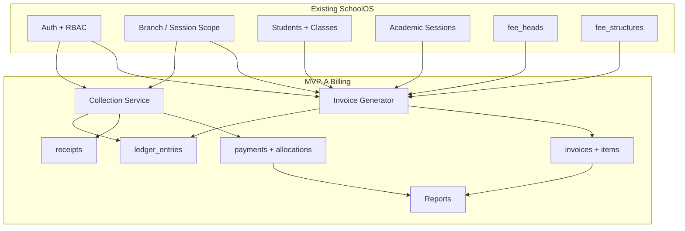

# SchoolOS Billing — MVP-A Implementation Plan

> **Source:** [BILLING_MVP_SCOPE.md](./BILLING_MVP_SCOPE.md)  
> **Preflight:** [BILLING_MVP_PREFLIGHT_REVIEW.md](./BILLING_MVP_PREFLIGHT_REVIEW.md) — Indian school scenario patches merged below  
> **Goal:** Ship a school-ready counter billing system in **~8 weeks** (2 engineers).  
> **Scope:** MVP-A only. Phase B/C, Phase A-complete features explicitly excluded.  
> **Date:** June 12, 2026 (rev. 2 — post-preflight)

---

## Table of Contents

1. [Overview](#1-overview)
2. [Exact Database Tables (MVP-A)](#2-exact-database-tables-mvp-a)
3. [Exact APIs (MVP-A)](#3-exact-apis-mvp-a)
4. [Exact UI Pages (MVP-A)](#4-exact-ui-pages-mvp-a)
5. [Drizzle Schema Plan](#5-drizzle-schema-plan)
6. [Migration Order](#6-migration-order)
7. [Sprint-Wise Implementation Tasks](#7-sprint-wise-implementation-tasks)
8. [Dependencies with Current SchoolOS Codebase](#8-dependencies-with-current-schoolos-codebase)
9. [Reusable Existing Tables](#9-reusable-existing-tables)
10. [Remove / Deprecate](#10-remove--deprecate)
11. [Definition of Done (Go-Live)](#11-definition-of-done-go-live)
12. [Preflight Patches (Mandatory Before Sprint 1)](#12-preflight-patches-mandatory-before-sprint-1)

---

## 1. Overview

### What MVP-A delivers

```
Admin sets fee heads + class fees → Bulk generate monthly invoices →
Clerk searches student → Collects payment → Prints numbered receipt →
Accounts runs daily collection + outstanding reports
```

### Constraints (match current codebase)

| Decision | Choice | Reason |
|----------|--------|--------|
| Primary keys | `serial` integer | Matches all existing SchoolOS tables |
| Tenancy columns | `society_id`, `school_id`, `branch_id`, `session_id` | Matches students, fee_structures |
| Amounts | `integer` (whole rupees) | Matches `fee_records.amount` today; migrate to `numeric` later |
| API path pattern | `/branches/:branchId/sessions/:sessionId/...` | Matches `fees.ts`, `fee-structures.ts` |
| Auth | JWT + `requireAuthHandler` + `authorizeRequestHandler` | Existing middleware |
| Permissions | Extend `fees.manage` / add `fees.collect` | Minimal RBAC change |
| Invoice lifecycle | **Generate = published** | No draft workflow in MVP |
| Receipt delivery | Browser print from HTML | No S3/PDF pipeline in MVP |
| Mid-month admission | **Prorate or skip** (session flag) | See [Preflight §1](#12-preflight-patches-mandatory-before-sprint-1) |
| Wrong payment | **Void** (admin only) | Not inline edit |
| Overpayment | **Advance credit** ledger entry | Not a separate wallet product |

### Inventory

| Asset | Count |
|-------|-------|
| New tables | **9** |
| Extended existing tables | **4** (`fee_structures`, `academic_sessions`, `students`, + void cols on billing tables) |
| Reused unchanged | **12+** |
| Deprecated tables | **1** (`fee_records`) |
| API endpoints | **33** |
| UI pages | **8** (+ 3 embedded panels) |
| New Drizzle schema files | **4** |
| Sprints | **6** × 1 week |

---

## 2. Exact Database Tables (MVP-A)

### 2.1 Reused without structural change

| Table | Role in billing |
|-------|-----------------|
| `platforms` | Platform tenancy root |
| `societies` | Society scope |
| `schools` | School scope |
| `branches` | Branch scope — all billing is branch-scoped |
| `academic_sessions` | Billing period boundary (2025–26) |
| `financial_sessions` | Optional link on invoices/payments |
| `classes` | Class-wise fee targeting |
| `sections` | Student display / report grouping |
| `students` | Bill-to entity; search by admission no / name / mobile |
| `users` | `collected_by`, `created_by` |
| `roles`, `permissions`, `user_role_assignments`, etc. | RBAC |
| `audit_logs` | Payment + config audit (write from app layer in MVP) |

### 2.2 Extended existing tables

#### `fee_heads` — keep table name, no rename

Already exists at `lib/db/src/schema/fee-structures.ts`. **No column changes required for MVP.**

| Existing column | Billing use |
|-----------------|-------------|
| `code`, `name` | Fee head identity |
| `branch_id` | Scope |
| `status` | Soft-disable head |

#### `fee_structures` — schema fix + 2 columns

> **Critical (Preflight P1):** Replace unique index `(session_id, class_id, fee_head_id)` with `(session_id, class_id, fee_head_id, effective_from)` so mid-year fee revisions work. Backfill `effective_from = session.starts_on` on existing rows; column becomes NOT NULL.

| Column | Type | Notes |
|--------|------|-------|
| `effective_from` | `date` NOT NULL | Already exists — enforce NOT NULL after backfill |
| `effective_to` | `date` nullable | Mid-year fee end |
| `billing_months` | `integer[]` nullable | Default `NULL` = every month; e.g. `{4,7,10,1}` for quarterly |

**Pricing resolver rule:** select row where `effective_from <= billing_period_end` AND (`effective_to` IS NULL OR `effective_to >= billing_period_start`), order by `effective_from DESC` LIMIT 1.

> **Note:** MVP uses `fee_structures` instead of a separate `pricing_matrix_rules` table. Same concept, zero migration confusion for the team. V2 rename can happen post go-live.

#### `academic_sessions` — add 2 columns

| New column | Type | Notes |
|------------|------|-------|
| `default_fee_due_day` | `integer` default `10` | Due day of month for generated invoices |
| `prorate_mid_month_admission` | `boolean` default `true` | When true, prorate admission-month fees; when false, skip admission month |

#### `students` — add 2 columns (Preflight P4)

| New column | Type | Notes |
|------------|------|-------|
| `billing_class_id` | integer FK nullable | If null, use `class_id` for fee structure lookup |
| `billing_class_effective_from` | `date` nullable | Use `billing_class_id` when `billing_period_start >= this date` |

Wire existing `admission_date` and `transport_assigned` in invoice generator (Preflight P2, P3).

### 2.3 New tables (9)

---

#### `invoices`

Fee demand document per student per billing period.

| Column | Type | Notes |
|--------|------|-------|
| `id` | serial PK | |
| `society_id` | integer FK | |
| `school_id` | integer FK | |
| `branch_id` | integer FK | |
| `session_id` | integer FK → academic_sessions | |
| `financial_session_id` | integer FK nullable | |
| `student_id` | integer FK → students | |
| `invoice_number` | text NOT NULL | From `number_sequences` |
| `billing_period_start` | date NOT NULL | e.g. 2025-04-01 |
| `billing_period_end` | date NOT NULL | e.g. 2025-04-30 |
| `billing_period_label` | text NOT NULL | e.g. `April 2025` — shown to clerk |
| `due_date` | date NOT NULL | |
| `status` | enum | `published \| partially_paid \| paid \| cancelled` |
| `total_gross` | integer NOT NULL | Sum of line gross |
| `total_discount` | integer NOT NULL default 0 | |
| `total_net` | integer NOT NULL | gross − discount |
| `total_paid` | integer NOT NULL default 0 | Denormalized cache; source of truth = allocations |
| `billing_run_id` | integer FK nullable → billing_runs | |
| `idempotency_key` | text NOT NULL | `{branch}:{session}:{student}:{period_start}` UNIQUE |
| `created_at`, `updated_at` | timestamptz | |
| `created_by` | integer FK nullable | |

**Indexes:** `(branch_id, session_id, student_id)`, `(branch_id, session_id, status, due_date)`, UNIQUE `(branch_id, idempotency_key)`

---

#### `invoice_items`

| Column | Type | Notes |
|--------|------|-------|
| `id` | serial PK | |
| `invoice_id` | integer FK → invoices ON DELETE CASCADE | |
| `fee_head_id` | integer FK → fee_heads | |
| `description` | text NOT NULL | e.g. `April Tuition` |
| `gross_amount` | integer NOT NULL | |
| `discount_amount` | integer NOT NULL default 0 | Line discount |
| `net_amount` | integer NOT NULL | |
| `paid_amount` | integer NOT NULL default 0 | Updated on allocation |
| `fee_structure_id` | integer FK nullable | Traceability |
| `student_fee_assignment_id` | integer FK nullable | Override traceability |

**Indexes:** `(invoice_id)`, `(fee_head_id)`

---

#### `ledger_entries`

Append-only financial truth. Balances derived from here.

| Column | Type | Notes |
|--------|------|-------|
| `id` | serial PK | |
| `society_id`, `school_id`, `branch_id`, `session_id` | integer FK | |
| `student_id` | integer FK → students | |
| `entry_type` | enum | `charge \| payment \| discount \| advance` |
| `direction` | enum | `debit \| credit` |
| `amount` | integer NOT NULL | Always positive |
| `fee_head_id` | integer FK nullable | |
| `invoice_id` | integer FK nullable | |
| `invoice_item_id` | integer FK nullable | |
| `payment_id` | integer FK nullable | |
| `reference_entry_id` | integer FK nullable → ledger_entries | Future reversals |
| `entry_date` | date NOT NULL | Business date |
| `narration` | text NOT NULL | |
| `is_void` | boolean default false | |
| `created_at` | timestamptz | |
| `created_by` | integer FK nullable | |

**Indexes:** `(branch_id, student_id, entry_date DESC)`, `(branch_id, session_id, entry_type)`, `(payment_id)`, `(invoice_id)`

**Posting rules:**

| Event | entry_type | direction |
|-------|------------|-----------|
| Invoice generated | `charge` | `debit` |
| Student-level discount on invoice | `discount` | `credit` |
| Payment collected | `payment` | `credit` |
| Overpayment (unallocated) | `advance` | `credit` |
| Advance applied to invoice | `advance` | `debit` |

---

#### `payments`

| Column | Type | Notes |
|--------|------|-------|
| `id` | serial PK | |
| `society_id`, `school_id`, `branch_id`, `session_id` | integer FK | |
| `student_id` | integer FK | |
| `payment_number` | text NOT NULL | From `number_sequences` |
| `payment_date` | date NOT NULL | |
| `amount` | integer NOT NULL | Total cash received |
| `unallocated_amount` | integer NOT NULL default 0 | Advance credit portion of this payment |
| `payment_method` | enum | Reuse existing `payment_method` enum: `cash \| upi \| cheque \| card \| online` |
| `transaction_ref` | text nullable | UPI ref |
| `counter_batch_id` | text nullable | Links sibling batch payments from one counter visit |
| `notes` | text nullable | |
| `is_void` | boolean default false | |
| `voided_at` | timestamptz nullable | |
| `voided_by` | integer FK nullable | |
| `void_reason` | text nullable | |
| `collected_by` | integer FK → users | |
| `created_at` | timestamptz | |
| `created_by` | integer FK nullable | |

**Indexes:** `(branch_id, session_id, payment_date DESC)`, `(student_id)`

---

#### `payment_allocations`

| Column | Type | Notes |
|--------|------|-------|
| `id` | serial PK | |
| `payment_id` | integer FK → payments ON DELETE RESTRICT | |
| `invoice_id` | integer FK → invoices | |
| `invoice_item_id` | integer FK nullable → invoice_items | NULL = allocate to invoice total |
| `amount` | integer NOT NULL | |
| `is_void` | boolean default false | Set true when payment voided |
| `created_at` | timestamptz | |

**Indexes:** `(payment_id)`, `(invoice_id)`

**Allocation algorithm (MVP):** Oldest unpaid invoice first; within invoice, fee heads in `fee_heads.code` sort order. Exclude voided allocations. If `applyAdvanceAmount` > 0 on payment request, consume prior advance credits (FIFO) before allocating cash.

---

#### `receipts`

| Column | Type | Notes |
|--------|------|-------|
| `id` | serial PK | |
| `society_id`, `school_id`, `branch_id` | integer FK | |
| `receipt_number` | text NOT NULL | Immutable; same as printed |
| `payment_id` | integer FK → payments UNIQUE | One receipt per payment in MVP |
| `student_id` | integer FK | |
| `receipt_data` | jsonb NOT NULL | Full snapshot at issue time — never update |
| `is_void` | boolean default false | |
| `void_reason` | text nullable | |
| `issued_at` | timestamptz NOT NULL | |
| `issued_by` | integer FK → users | |

**Indexes:** UNIQUE `(branch_id, receipt_number)`, `(payment_id)`

---

#### `number_sequences`

| Column | Type | Notes |
|--------|------|-------|
| `id` | serial PK | |
| `branch_id` | integer FK | |
| `session_id` | integer FK nullable | Reset per session |
| `sequence_type` | enum | `invoice \| receipt \| payment` |
| `prefix` | text NOT NULL | e.g. `INV-2526-` |
| `next_value` | integer NOT NULL default 1 | |
| `padding` | integer NOT NULL default 4 | |

**Indexes:** UNIQUE `(branch_id, session_id, sequence_type)`

---

#### `billing_runs`

| Column | Type | Notes |
|--------|------|-------|
| `id` | serial PK | |
| `society_id`, `school_id`, `branch_id`, `session_id` | integer FK | |
| `billing_period_start` | date NOT NULL | |
| `billing_period_end` | date NOT NULL | |
| `billing_period_label` | text NOT NULL | |
| `status` | enum | `pending \| running \| completed \| failed` |
| `total_students` | integer default 0 | |
| `invoices_created` | integer default 0 | |
| `invoices_skipped` | integer default 0 | Already existed |
| `error_message` | text nullable | |
| `started_at`, `completed_at` | timestamptz nullable | |
| `created_by` | integer FK | |

**Indexes:** `(branch_id, session_id, billing_period_start)`, UNIQUE `(branch_id, session_id, billing_period_start)` — one run per period

---

#### `student_fee_assignments`

Per-student fee overrides and exclusions.

| Column | Type | Notes |
|--------|------|-------|
| `id` | serial PK | |
| `society_id`, `school_id`, `branch_id`, `session_id` | integer FK | |
| `student_id` | integer FK → students | |
| `fee_head_id` | integer FK → fee_heads | |
| `override_amount` | integer nullable | Fixed override; NULL = use class structure |
| `discount_kind` | enum nullable | `fixed \| percent \| null` |
| `discount_value` | integer nullable | ₹ or % |
| `is_excluded` | boolean default false | Skip this head entirely |
| `effective_from` | date NOT NULL | |
| `effective_to` | date nullable | |
| `notes` | text nullable | e.g. `RTE`, `Staff child` |
| `created_at`, `updated_at` | timestamptz | |
| `created_by` | integer FK nullable | |

**Indexes:** `(student_id, session_id, fee_head_id, effective_from)`

---

### 2.4 Invoice generator rules (Preflight — implement in `invoice-generator.ts`)

| Rule | Behaviour |
|------|-----------|
| Student status | Bill only `students.status = 'active'` |
| Admission date | Skip periods where `billing_period_end < admission_date` |
| Admission month proration | If `prorate_mid_month_admission` and admitted mid-month: `round(amount × days_remaining / days_in_month)` |
| Fee class | Use `billing_class_id` when set and period ≥ `billing_class_effective_from`, else `class_id` |
| Transport | Exclude transport head when `transport_assigned = false` and no assignment |
| Assignments | Honour `student_fee_assignments` `effective_from`, `effective_to`, `is_excluded`, overrides |
| TC / leave | On status → `transferred` \| `inactive` \| `graduated`: auto-cancel unpaid invoices with `due_date > today` |

**Proration helper:** `lib/billing/proration.ts` — shared by admission and transport activation month.

---

### 2.5 Table count summary

| Category | Tables |
|----------|--------|
| Reused unchanged | 12+ core platform/student tables |
| Extended | `fee_structures` (unique index + cols), `academic_sessions` (+2 cols), `students` (+2 cols) |
| **New** | `invoices`, `invoice_items`, `ledger_entries`, `payments`, `payment_allocations`, `receipts`, `number_sequences`, `billing_runs`, `student_fee_assignments` |
| **Deprecated** | `fee_records` |

**Total new DDL objects:** 9 tables + 4 enums + indexes + 1 unique index replacement

---

## 3. Exact APIs (MVP-A)

Base: authenticated requests under existing API server.  
Path convention: `/branches/:branchId/sessions/:sessionId/...` unless noted.

Permission key: `fees.manage` (config + reports), `fees.collect` (counter — new seed permission).

### 3.1 Configuration — 13 endpoints

| # | Method | Path | Description | Permission |
|---|--------|------|-------------|------------|
| 1 | GET | `/branches/:branchId/fee-heads` | List fee heads | `fees.manage` |
| 2 | POST | `/branches/:branchId/fee-heads` | Create fee head | `fees.manage` |
| 3 | PATCH | `/branches/:branchId/fee-heads/:headId` | Update / deactivate head | `fees.manage` |
| 4 | GET | `/branches/:branchId/sessions/:sessionId/fee-structures` | List class × head matrix (supports multiple effective dates) | `fees.manage` |
| 5 | POST | `/branches/:branchId/sessions/:sessionId/fee-structures` | Create structure row (with `effective_from`) | `fees.manage` |
| 6 | DELETE | `/branches/:branchId/sessions/:sessionId/fee-structures/:id` | Remove structure row | `fees.manage` |
| 7 | POST | `/branches/:branchId/sessions/:newSessionId/fee-structures/clone` | Clone from prior session (rollover) | `fees.manage` |
| 8 | GET | `/branches/:branchId/sessions/:sessionId/students/:studentId/fee-assignments` | List overrides | `fees.manage` |
| 9 | POST | `/branches/:branchId/sessions/:sessionId/students/:studentId/fee-assignments` | Create override / discount / exclude | `fees.manage` |
| 10 | PATCH | `/branches/:branchId/sessions/:sessionId/students/:studentId/fee-assignments/:id` | Update assignment | `fees.manage` |
| 11 | DELETE | `/branches/:branchId/sessions/:sessionId/students/:studentId/fee-assignments/:id` | Remove assignment | `fees.manage` |
| 12 | PATCH | `/branches/:branchId/sessions/:sessionId/billing-settings` | Set due day + proration flag | `fees.manage` |
| 13 | GET | `/branches/:branchId/sessions/:sessionId/billing-settings` | Get settings + readiness check | `fees.manage` |

> Endpoints 1–6 **already exist** (partial). Extend for dated fee structures; add #7 clone, #3 PATCH on fee-heads.

### 3.2 Billing — 10 endpoints

| # | Method | Path | Description | Permission |
|---|--------|------|-------------|------------|
| 14 | POST | `/branches/:branchId/sessions/:sessionId/billing-runs` | Bulk invoice generation (current session only; `force` for admin) | `fees.manage` |
| 15 | GET | `/branches/:branchId/sessions/:sessionId/billing-runs/:runId` | Run status + counts | `fees.manage` |
| 16 | GET | `/branches/:branchId/sessions/:sessionId/billing-runs` | List runs | `fees.manage` |
| 17 | POST | `/branches/:branchId/sessions/:sessionId/students/:studentId/invoices/generate` | Single-student generate (admission desk) | `fees.manage` |
| 18 | POST | `/branches/:branchId/sessions/:sessionId/invoices/:invoiceId/cancel` | Cancel unpaid invoice (TC / correction) | `fees.manage` |
| 19 | GET | `/branches/:branchId/sessions/:sessionId/invoices` | List invoices (filters: student, status, period) | `fees.manage`, `fees.collect` |
| 20 | GET | `/branches/:branchId/sessions/:sessionId/invoices/:invoiceId` | Invoice + items | `fees.manage`, `fees.collect` |
| 21 | GET | `/branches/:branchId/sessions/:sessionId/students/:studentId/invoices` | Student invoice history | `fees.manage`, `fees.collect` |
| 22 | GET | `/branches/:branchId/sessions/:sessionId/students/:studentId/outstanding` | Due + `advanceCredit` + invoice breakdown | `fees.manage`, `fees.collect` |
| 23 | GET | `/branches/:branchId/sessions/:sessionId/students/:studentId/ledger` | Chronological ledger entries | `fees.manage` |

### 3.3 Collections — 8 endpoints

| # | Method | Path | Description | Permission |
|---|--------|------|-------------|------------|
| 24 | POST | `/branches/:branchId/sessions/:sessionId/payments` | Record payment + allocate + receipt + advance handling | `fees.collect` |
| 25 | POST | `/branches/:branchId/sessions/:sessionId/payments/batch` | Multi-student sibling collect (one transaction) | `fees.collect` |
| 26 | POST | `/branches/:branchId/sessions/:sessionId/payments/:paymentId/void` | Void payment + receipt + reopen invoices | `fees.manage` |
| 27 | GET | `/branches/:branchId/sessions/:sessionId/payments` | List payments (excludes void by default) | `fees.manage`, `fees.collect` |
| 28 | GET | `/branches/:branchId/sessions/:sessionId/payments/:paymentId` | Payment + allocations | `fees.manage`, `fees.collect` |
| 29 | GET | `/branches/:branchId/sessions/:sessionId/receipts/:receiptId` | Receipt snapshot JSON | `fees.manage`, `fees.collect` |
| 30 | GET | `/branches/:branchId/sessions/:sessionId/receipts/by-payment/:paymentId` | Receipt for payment (reprint) | `fees.manage`, `fees.collect` |
| 31 | GET | `/branches/:branchId/sessions/:sessionId/students/search` | Search by admission no / name / mobile; `groupByParent=true` returns all siblings | `fees.collect`, `fees.manage` |

> **Payment POST (#24) is one atomic transaction:** apply advance (optional) → create payment → allocate to oldest invoices → post ledger → post advance credit for excess → create receipt → return print payload.

> **Payment void (#26):** admin/accountant only (`fees.manage`). Voids payment, receipt, allocations, ledger entries; recomputes invoice status. Audit log required.

### 3.4 Reports — 2 endpoints

| # | Method | Path | Description | Permission |
|---|--------|------|-------------|------------|
| 32 | GET | `/branches/:branchId/sessions/:sessionId/reports/daily-collection` | Date-range register (excludes void; optional void section) | `fees.manage` |
| 33 | GET | `/branches/:branchId/sessions/:sessionId/reports/outstanding` | Defaulters by class; toggle include TC students | `fees.manage` |

**Total: 33 endpoints** (6 exist today; 27 net new or materially changed)

### 3.5 APIs explicitly NOT in MVP-A

- Invoice draft/publish workflow (generate = published)
- Payment reallocate (without void)
- Late fee rules / cron
- Waiver / ad-hoc charge API
- Refund payout workflow
- Fee-head-wise collection report
- PDF upload to object storage
- Webhook / online gateway
- Cheque bounce lifecycle
- Family wallet / shared balance account

---

## 4. Exact UI Pages (MVP-A)

Route pattern follows existing `App.tsx` + `navigation-registry.ts`.

| # | Route | Page file | Primary user | Replaces / notes |
|---|-------|-----------|--------------|------------------|
| 1 | `/fee-structure` | `pages/fee-structure.tsx` | Accounts / Admin | **Rewrite** — fee heads + class matrix + due day |
| 2 | `/billing/generate` | `pages/billing-generate.tsx` | Accounts | **New** — bulk fee generation |
| 3 | `/billing/collect` | `pages/billing-collect.tsx` | Clerk | **New** — counter: sibling search, advance display, session picker |
| 4 | `/billing/receipt/:receiptId` | `pages/billing-receipt.tsx` | Clerk | **New** — print / reprint (shows void watermark if voided) |
| 5 | `/students/:id/fees` | tab in `student-detail.tsx` | Accounts | Overrides, transport toggle, billing class effective date |
| 6 | `/reports/daily-collection` | `pages/report-daily-collection.tsx` | Accounts / Principal | Session selector; void section |
| 7 | `/reports/outstanding` | `pages/report-outstanding.tsx` | Accounts / Principal | Session selector; include TC toggle |
| 8 | `/fees` | `pages/fees.tsx` | Accounts | Invoice list + payment void action (admin) |

### Embedded panels (not separate routes)

| Location | Panel | Purpose |
|----------|-------|---------|
| `billing-collect.tsx` | Parent-mobile search → all siblings with dues | Sibling batch collect |
| `billing-collect.tsx` | Advance credit banner + apply checkbox | Overpayment / prepay |
| `billing-collect.tsx` | Session selector (default current) | Collect prior-session dues |
| `student-detail.tsx` | "Fees" tab | Override form + mini ledger + generate single invoice |

### Navigation updates (`navigation-registry.ts`)

```text
/fee-structure        → "Fee Structure"     [school_admin, principal]
/billing/generate     → "Generate Fees"     [school_admin, accountant]
/billing/collect      → "Collect Fee"       [accountant] + fees.collect
/fees                 → "Invoices"          [school_admin, principal, accountant]
/reports/daily-collection → "Daily Collection" [school_admin, principal, accountant]
/reports/outstanding  → "Outstanding Dues"  [school_admin, principal, accountant]
```

Principal gets read-only on reports + invoice list; no collect permission.

---

## 5. Drizzle Schema Plan

### 5.1 New schema files

| File | Exports |
|------|---------|
| `lib/db/src/schema/billing-invoices.ts` | `invoicesTable`, `invoiceItemsTable`, `invoiceStatusEnum` |
| `lib/db/src/schema/billing-ledger.ts` | `ledgerEntriesTable`, `ledgerEntryTypeEnum`, `ledgerDirectionEnum` |
| `lib/db/src/schema/billing-collections.ts` | `paymentsTable`, `paymentAllocationsTable`, `receiptsTable` |
| `lib/db/src/schema/billing-config.ts` | `numberSequencesTable`, `billingRunsTable`, `billingRunStatusEnum`, `studentFeeAssignmentsTable`, `discountKindEnum`, `sequenceTypeEnum` |

### 5.2 Modified schema files

| File | Changes |
|------|---------|
| `lib/db/src/schema/fee-structures.ts` | Replace unique index; add `effectiveTo`, `billingMonths`; enforce `effectiveFrom` NOT NULL |
| `lib/db/src/schema/academic-sessions.ts` | Add `defaultFeeDueDay`, `prorateMidMonthAdmission` |
| `lib/db/src/schema/students.ts` | Add `billingClassId`, `billingClassEffectiveFrom` |
| `lib/db/src/schema/enums.ts` | Add billing enums; `advance` on ledger entry type |
| `lib/db/src/schema/relations.ts` | Relations for all new tables |
| `lib/db/src/schema/index.ts` | Export new modules |
| `lib/db/src/schema/insert-schemas.ts` | Zod insert schemas for API validation |

### 5.3 Core service modules (api-server)

| File | Responsibility |
|------|----------------|
| `artifacts/api-server/src/lib/billing/pricing-resolver.ts` | Dated class fee + billing_class + assignment effective dates |
| `artifacts/api-server/src/lib/billing/proration.ts` | Mid-month admission / transport proration |
| `artifacts/api-server/src/lib/billing/invoice-generator.ts` | Bulk + single student; active-only; idempotent |
| `artifacts/api-server/src/lib/billing/invoice-cancel.ts` | Cancel unpaid invoice + void charges |
| `artifacts/api-server/src/lib/billing/ledger-service.ts` | Post charge / payment / discount / advance entries |
| `artifacts/api-server/src/lib/billing/payment-service.ts` | Collect + advance + allocate + receipt |
| `artifacts/api-server/src/lib/billing/payment-void.ts` | Void payment + receipt + reopen invoices |
| `artifacts/api-server/src/lib/billing/allocation.ts` | Oldest-invoice-first; advance FIFO apply |
| `artifacts/api-server/src/lib/billing/number-sequence.ts` | Atomic next number |
| `artifacts/api-server/src/lib/billing/balance.ts` | Outstanding + advanceCredit from ledger |
| `artifacts/api-server/src/lib/billing/student-status-hook.ts` | Auto-cancel future invoices on TC |

### 5.4 Route files

| File | Action |
|------|--------|
| `artifacts/api-server/src/routes/fee-structures.ts` | Extend |
| `artifacts/api-server/src/routes/fees.ts` | **Replace** → split into `billing-invoices.ts`, `billing-collections.ts`, `billing-reports.ts` |
| `artifacts/api-server/src/routes/billing-invoices.ts` | **New** |
| `artifacts/api-server/src/routes/billing-collections.ts` | **New** |
| `artifacts/api-server/src/routes/billing-reports.ts` | **New** |
| `artifacts/api-server/src/routes/index.ts` | Register new routers |
| `artifacts/api-server/src/lib/route-permissions.ts` | Add billing route rules |

### 5.5 OpenAPI / client codegen

| Package | Action |
|---------|--------|
| OpenAPI spec (source of `@workspace/api-zod`) | Add 33 billing paths |
| `lib/api-zod` | Regenerate Zod + React Query hooks |
| `lib/api-client-react` | Regenerate hooks consumed by UI |

---

## 6. Migration Order

Execute in this order. Each step is one Drizzle migration (or grouped where noted).

| Step | Migration | Depends on | Rollback risk |
|------|-----------|------------|---------------|
| **M1** | Add enums: `invoice_status`, `ledger_entry_type` (+ `advance`), `ledger_direction`, `billing_run_status`, `discount_kind`, `sequence_type` | — | Low |
| **M2** | Alter `academic_sessions` add `default_fee_due_day`, `prorate_mid_month_admission` | M1 | Low |
| **M2b** | Alter `students` add `billing_class_id`, `billing_class_effective_from` | M1 | Low |
| **M3** | Alter `fee_structures`: add `effective_to`, `billing_months`; **replace unique index** to include `effective_from`; backfill + NOT NULL | M1 | **High** — blocks fee revision |
| **M4** | Create `number_sequences` | M1 | Low |
| **M5** | Create `billing_runs` | M1, M2 | Low |
| **M6** | Create `student_fee_assignments` | M1, fee_heads | Low |
| **M7** | Create `invoices` + `invoice_items` | M1, M5, students, fee_heads | Medium |
| **M8** | Create `ledger_entries` | M7 | Medium |
| **M9** | Create `payments` + `payment_allocations` + `receipts` | M7, M8, M4 | Medium |
| **M10** | Seed `number_sequences` per existing branch+session | M4 | Low |
| **M11** | Seed permission `fees.collect` + assign to accountant role | RBAC tables | Low |
| **M12** | Data migration script: `fee_records` → invoices/payments/ledger (if any production data) | M7–M9 | **High** |
| **M13** | Mark `fee_records` deprecated: stop writes via feature flag | App deploy | Medium |
| **M14** | Drop `fee_records` (post go-live + 30 days) | M12 verified | High |

### Migration commands (team workflow)

```bash
# From lib/db
pnpm drizzle-kit generate
pnpm drizzle-kit migrate

# One-off data migration (if needed)
pnpm tsx src/run-billing-mvp-migration.ts
```

### M12 data migration logic (if `fee_records` has data)

```
For each fee_record where paidAmount > 0 or status != pending:
  1. Create invoice (period = due_date month, single line item feeType → match fee_head by name/code)
  2. Post CHARGE ledger entry
  3. If paidAmount > 0: create payment + allocation + receipt + PAYMENT ledger entry
  4. If discount > 0: post DISCOUNT ledger entry
Verify: sum(ledger debits) - sum(credits) = outstanding per student
```

---

## 7. Sprint-Wise Implementation Tasks

**Team:** 2 engineers (BE-heavy S1–S3, FE-heavy S3–S5), 1 QA from S4.  
**Duration:** 6 sprints × 1 week = **6 weeks core** + **2 weeks UAT/hardening** = **8 weeks total**.

---

### Sprint 1 — Schema + Ledger Foundation

**Goal:** Database ready; fee revision index fixed; can post a manual charge and read balance.

| Task | Owner | Done when |
|------|-------|-----------|
| M1–M6, M2b migrations (**include M3 unique index fix**) | BE | Migrations apply on staging |
| Drizzle schema files + relations | BE | `pnpm build` passes in `lib/db` |
| `ledger-service.ts` — charge / payment / discount / **advance** | BE | Unit test: charge − payment = balance |
| `number-sequence.ts` — atomic increment | BE | Concurrent test passes |
| `balance.ts` — outstanding + **advanceCredit** query | BE | Matches manual SQL |
| Seed `fees.collect` permission | BE | Accountant role has it |
| Extend `route-permissions.ts` stubs | BE | Routes registered (501 OK) |

**Sprint 1 exit:** CLI/script can create invoice + ledger entries for one test student. Fee structure allows two dated rows for same class+head.

---

### Sprint 2 — Pricing + Invoice Generation

**Goal:** Admin configures dated fees; bulk + single-student generate with admission proration.

| Task | Owner | Done when |
|------|-------|-----------|
| M7–M8 migrations | BE | Invoices + items exist |
| Extend `fee-structures` API (dated rows, clone endpoint) | BE | August revision + clone session works |
| `pricing-resolver.ts` — dated structures + billing_class | BE | Unit tests pass |
| `proration.ts` + wire into generator | BE | July admit on 20th prorated correctly |
| `invoice-generator.ts` — active-only, admission gate, idempotent | BE | Re-run skips existing |
| Single-student generate API (#17) | BE | Admission desk can bill one student |
| `billing-runs` API — bulk async loop | BE | 500 students < 2 min locally |
| Rewrite `fee-structure.tsx` (timeline per class+head) | FE | Multiple effective dates visible |
| New `billing-generate.tsx` | FE | Trigger run + show progress |
| OpenAPI + codegen for config + billing APIs | BE | Hooks available |

**Sprint 2 exit:** Accounts generates April invoices; mid-July admission gets prorated July invoice via single-student generate.

---

### Sprint 3 — Counter Collection + Receipt + Advance

**Goal:** Clerk collects payment; overpayment stored as advance; sibling batch collect.

| Task | Owner | Done when |
|------|-------|-----------|
| M9 migration (payments void cols, etc.) | BE | Payments table live |
| `payment-service.ts` — collect + allocate + advance credit | BE | ₹12k on ₹8k due → ₹4k advance |
| `allocation.ts` — oldest invoice + advance apply on collect | BE | Partial + advance apply tests pass |
| Student search API with `groupByParent=true` | BE | Returns all siblings by mobile |
| Payments batch API (#25) | BE | 3 receipts, 1 transaction |
| Outstanding API returns `advanceCredit` | BE | Shown on collect screen |
| Payments + receipts APIs | BE | Reprint returns same snapshot |
| `billing-collect.tsx` — siblings + advance + session picker | FE | Batch collect demo works |
| `billing-receipt.tsx` | FE | Browser print layout |

**Sprint 3 exit:** Parent pays for 3 siblings in one action; overpayment shows as advance next visit.

---

### Sprint 4 — Overrides, TC Cancel, Invoice Hub

**Goal:** Transport on/off; TC stops future billing; RTE overrides; invoice list.

| Task | Owner | Done when |
|------|-------|-----------|
| Wire assignment `effective_from/to` + `transport_assigned` | BE | Deactivated transport excluded |
| `invoice-cancel.ts` + API (#18) | BE | Unpaid invoice cancelled |
| `student-status-hook.ts` on TC/transfer | BE | Future unpaid invoices auto-cancelled |
| `student_fee_assignments` API full CRUD | BE | Transport assignment with dates |
| Student fees tab + billing class effective date UI | FE | Class promotion fee date set |
| Rewrite `fees.tsx` → invoice list + cancel action | FE | Filter by status/class |
| Invoice detail + ledger tab | FE | Line items visible |
| Audit log on payment, void, cancel, config | BE | Row in `audit_logs` |

**Sprint 4 exit:** TC student gets no next month invoice; transport off from December excluded.

---

### Sprint 5 — Void, Reports, Session Rollover

**Goal:** Wrong payment fixable; reports accurate; prior-session collection works.

| Task | Owner | Done when |
|------|-------|-----------|
| `payment-void.ts` + API (#26) | BE | Void reopens invoice; daily report excludes |
| Payment void UI on invoice/payment detail (admin only) | FE | Accounts can void same-day error |
| Daily collection report API + page | BE/FE | Matches cash tally; void section |
| Outstanding report + TC toggle | BE/FE | Grouped by class |
| Session selector on collect + reports | FE | Can collect 2025–26 dues in 2026–27 |
| Fee structure clone UI / API (#7) | FE/BE | New session fees copied |
| Navigation + RBAC enforcement | FE/BE | Principal 403 on collect |
| Dashboard fee widget from invoices | BE/FE | Replaces fee_records metric |

**Sprint 5 exit:** Void ₹50k typo; collect old session outstanding; clone fees to new session.

---

### Sprint 6 — Migration, Hardening, Go-Live

**Goal:** Production cutover; all 10 preflight scenarios pass UAT.

| Task | Owner | Done when |
|------|-------|-----------|
| M12 data migration script + dry run | BE | Zero balance mismatch |
| Parallel reconciliation report | BE | Old vs new totals match |
| Feature flag `billing_v2_enabled` per branch | BE | Rollback possible |
| Disable old `fees.ts` endpoints | BE | 410 on legacy routes |
| **E2E: all 10 preflight scenarios** (see §12) | QA | Automated or scripted pass |
| UAT with pilot school accounts team | QA/PM | Sign-off checklist §11.1 (23 items) |
| Runbook: admission, TC, rollover, void | Docs | Hindi/English |
| M13 deprecate fee_records writes | BE | Only billing_v2 path |
| Performance smoke: 2000 students billing run | BE | < 5 min |

**Sprint 6 exit:** Pilot branch live on MVP-A for one full billing month.

---

## 8. Dependencies with Current SchoolOS Codebase

### 8.1 Hard dependencies (must exist before billing work)

| Dependency | Location | Billing use |
|------------|----------|-------------|
| Branch + session scope | `artifacts/api-server/src/lib/scope.ts` | All billing scoped correctly |
| Auth middleware | `require-auth.ts`, `authorize-request.ts` | Secure endpoints |
| RBAC permissions | `lib/db/src/seed-phase0-foundation.ts` | `fees.manage`, new `fees.collect` |
| Students CRUD | `routes/students.ts` | Bill-to records |
| Classes list | `routes/classes.ts` | Fee matrix columns |
| Academic sessions | `routes/sessions.ts` | Session binding |
| `useScope()` hook | `artifacts/school-os/src/lib/use-scope.ts` | branchId + sessionId in UI |
| Layout + navigation | `layout.tsx`, `navigation-registry.ts` | Menu items |
| API client | `@workspace/api-client-react` | Generated hooks |

### 8.2 Soft dependencies (nice to have, not blocking)

| Dependency | Impact if missing |
|------------|-------------------|
| `financial_sessions` | Can omit FK; use academic session only |
| `accounts-dashboard.tsx` | Reports accessible via nav directly |
| Analytics fee widgets | Dashboard shows stale data until updated |
| Parent portal | Out of scope MVP |
| Admission leads | Manual student create still works |

### 8.3 Parallel work (no blocking)

- UDISE, examinations, attendance — independent
- Platform admin screens — independent

### 8.4 Dependency diagram



---

## 9. Reusable Existing Tables

| Table | Reuse strategy |
|-------|----------------|
| `fee_heads` | **Keep as-is.** Primary fee configuration entity. |
| `fee_structures` | **Extend** — dated rows via new unique index; resolver picks by period |
| `academic_sessions` | **Extend** with `default_fee_due_day`, `prorate_mid_month_admission` |
| `students` | **Extend** with `billing_class_id`, `billing_class_effective_from`; use `admission_date`, `transport_assigned`, `status` in generator |
| `payment_method` enum | **Keep.** Already has cash, upi, cheque, card, online. |
| `audit_logs` | **Keep.** Write from billing services on payment + config changes. |
| `users` | **Keep.** `collected_by`, `created_by`. |
| `fee_records` | **Do not extend.** Migrate and retire. |

### Existing API routes to reuse

| Route file | Endpoints kept |
|------------|----------------|
| `fee-structures.ts` | GET/POST fee-heads, GET/POST fee-structures (+ extend) |

### Existing UI to reuse

| File | Reuse |
|------|-------|
| `fee-structure.tsx` | Rewrite in place — same route |
| `student-detail.tsx` | Add Fees tab |
| `accounts-dashboard.tsx` | Update links only |

---

## 10. Remove / Deprecate

### 10.1 Deprecate immediately when MVP-A ships (Sprint 6)

| Asset | Action |
|-------|--------|
| `fee_records` table | Stop writes; read-only for reconciliation |
| `POST .../fees` (create fee record) | Return `410 Gone` with migration message |
| `POST .../fees/:feeId/pay` | Return `410 Gone` |
| `GET .../fees/summary` based on fee_records | Replace with invoice/payment summary |
| `pages/fees.tsx` list of fee_records | Replace with invoice list |
| Dashboard recent payments from fee_records | Point to payments table |
| `student-detail.tsx` fee_records tab | Replace with invoices + ledger |
| Analytics fee metrics from fee_records | Point to invoices (Sprint 5 or hotfix) |

### 10.2 Delete after 30-day post go-live verification

| Asset | Condition |
|-------|-----------|
| `fee_records` table | Reconciliation report zero mismatches |
| `lib/db/src/schema/fees.ts` | All code references removed |
| `artifacts/api-server/src/routes/fees.ts` | Split/replaced by billing routes |
| Old OpenAPI fee_record schemas | Removed from codegen |

### 10.3 Do NOT build (avoid scope creep)

- `pricing_matrix_rules` as separate table — use extended `fee_structures`
- `fee_head_nodes` rename — keep `fee_heads`
- `student_group_*` tables
- `concession_schemes`
- `billing_run_items`
- `late_fee_rules`
- `bank_accounts`
- Invoice **draft** workflow (cancel/void are in scope)
- Refund payout workflow
- Family wallet account
- Event billing engine
- Cheque bounce lifecycle

---

## 11. Definition of Done (Go-Live)

### 11.1 Functional checklist (pilot school sign-off)

| # | Criterion | Verified by |
|---|-----------|-------------|
| 1 | Admin creates ≥ 3 fee heads (Tuition, Transport, Lab) | Accounts |
| 2 | Admin sets class-wise fees for all classes in current session | Accounts |
| 3 | Admin generates monthly fees for all active students in one action | Accounts |
| 4 | Re-running generation does **not** duplicate invoices | BE test |
| 5 | Clerk finds student by admission number in < 5 seconds | Clerk |
| 6 | Clerk sees correct outstanding with fee head breakdown | Clerk |
| 7 | Clerk records partial payment; balance updates correctly | Clerk |
| 8 | Clerk prints receipt with **unique sequential receipt number** | Clerk |
| 9 | Clerk reprints receipt — **same number, same data** | Clerk |
| 10 | Admin sets RTE student discount / transport exclusion | Accounts |
| 11 | Next invoice reflects student override | Accounts |
| 12 | Daily collection report matches physical cash tally for the day | Accounts |
| 13 | Outstanding report lists all defaulters by class | Principal |
| 14 | Principal cannot access collect screen (403) | QA |
| 15 | Payment cannot be edited — accounts **voids** with reason (same day) | Accounts |
| 16 | Student admitted 20 July billed pro-rata (or skipped per session setting) | Accounts |
| 17 | Transport excluded after deactivation effective date | Accounts |
| 18 | TC student receives no next-month invoice; unpaid future invoices cancelled | Accounts |
| 19 | August fee revision uses new amount; July invoice unchanged | Accounts |
| 20 | Parent mobile search shows siblings; batch collect prints N receipts | Clerk |
| 21 | Overpayment ₹12,000 on ₹8,000 due → ₹4,000 advance on next visit | Clerk |
| 22 | Accounts voids wrong payment; invoice reopens; excluded from daily report | Accounts |
| 23 | Counter collects prior-session dues after new session is current | Clerk |

### 11.2 Technical checklist

| # | Criterion |
|---|-----------|
| 1 | All M1–M11 migrations applied on production |
| 2 | `fee_records` write path disabled |
| 3 | Ledger balance = invoice outstanding for 100 random students (automated test) |
| 4 | Billing run for 2000 students completes in < 5 minutes |
| 5 | Payment API is transactional (rollback on any failure) |
| 6 | `fees.collect` and `fees.manage` permissions seeded |
| 7 | Audit log entry on every payment |
| 8 | No P0/P1 bugs open on billing flows |
| 9 | Runbook documented for month-start billing |
| 10 | Rollback flag `billing_v2_enabled` tested |

### 11.3 Data integrity rule (non-negotiable)

For every student in the pilot branch:

```
Outstanding = SUM(ledger debits) − SUM(ledger credits where not void)
            = SUM(invoice.total_net − invoice.total_paid) across unpaid invoices
```

Must hold after: generate, partial pay, full pay, discount override, reprint, **void, advance apply, invoice cancel**.

### 11.4 Go / No-Go decision

| Go | No-Go |
|----|-------|
| All **23** functional checks pass | Any duplicate invoice on re-run |
| Reconciliation vs old system ≥ 99.9% match (if migrating) | Balance mismatch on any student |
| All **10 preflight scenarios** pass (§12) | Clerk flow > 3 minutes average |
| Accounts team sign-off | Missing receipt numbers |
| 1 full billing cycle completed on staging | Fee revision blocked by unique index |

---

## 12. Preflight Patches (Mandatory Before Sprint 1)

Merged from [BILLING_MVP_PREFLIGHT_REVIEW.md](./BILLING_MVP_PREFLIGHT_REVIEW.md). **Do not start coding until M3 unique index is in Sprint 1 migration.**

| ID | Scenario | Patch |
|----|----------|-------|
| P1 | Fee revision from future date | Replace `fee_structures` unique index; dated resolver |
| P2 | Mid-month admission | Admission date gate + `proration.ts` + single-student generate |
| P3 | Transport on/off | Assignment effective dates + `transport_assigned` in generator |
| P4 | Student leaves (TC) | Active-only billing + invoice cancel + status hook |
| P5 | Advance payments | `advance` ledger type + `unallocated_amount` + apply on collect |
| P6 | Wrong entry / receipt cancel | `POST payments/:id/void` |
| P7 | Siblings pay together | Parent mobile sibling search + `POST payments/batch` |
| P8 | Session rollover | Session selector on collect/reports + clone fee structures |

### Preflight UAT scenarios (Sprint 6)

| # | Test |
|---|------|
| 1 | Admit student on 20 July → July invoice prorated |
| 2 | Activate transport 10 Sept → Sept transport prorated or full per config |
| 3 | Deactivate transport from 1 Dec → no Dec transport line |
| 4 | Mark TC in November → no December invoice |
| 5 | Promote class with `billing_class_effective_from` → correct fee from date |
| 6 | Add Aug fee row ₹3,300; Jul invoice still ₹3,000 |
| 7 | Batch pay 3 siblings by parent mobile |
| 8 | Pay ₹12k against ₹8k due; next month advance applies |
| 9 | Void wrong payment; invoice reopens |
| 10 | Collect 2025–26 dues while 2026–27 is current session |

---

## Appendix A — Permission seed change

Add to `lib/db/src/seed-phase0-foundation.ts`:

```typescript
{ key: "fees.collect", module: "fees", action: "collect", description: "Collect fees at counter" }
```

| Role | fees.manage | fees.collect |
|------|-------------|--------------|
| school_admin | ✓ | ✓ |
| principal | ✓ | ✗ |
| accountant | ✓ | ✓ |

---

## Appendix B — Receipt snapshot JSON shape

```json
{
  "receiptNumber": "RCP-2526-0042",
  "paymentNumber": "PAY-2526-0042",
  "issuedAt": "2025-04-18T10:32:00+05:30",
  "schoolName": "Delhi Public School",
  "branchName": "Main Campus",
  "sessionName": "2025-26",
  "student": {
    "admissionNumber": "ADM-1024",
    "name": "Raj Kumar",
    "class": "Class 5",
    "section": "A"
  },
  "payment": {
    "date": "2025-04-18",
    "method": "upi",
    "transactionRef": "UPI123456",
    "amount": 5000
  },
  "allocations": [
    { "invoiceNumber": "INV-2526-0100", "period": "April 2025", "feeHead": "Tuition", "amount": 3000 },
    { "invoiceNumber": "INV-2526-0100", "period": "April 2025", "feeHead": "Transport", "amount": 2000 }
  ],
  "collectedBy": "Priya Sharma"
}
```

---

## Appendix C — Related documents

- [BILLING_MVP_SCOPE.md](./BILLING_MVP_SCOPE.md) — Persona-driven scope
- [BILLING_MVP_PREFLIGHT_REVIEW.md](./BILLING_MVP_PREFLIGHT_REVIEW.md) — Indian school scenario analysis (source for rev. 2)
- [BILLING_ENGINE_V2_ARCHITECTURE.md](./BILLING_ENGINE_V2_ARCHITECTURE.md) — Long-term V2 vision (post MVP-A)
- [BILLING_ENGINE_ARCHITECTURE.md](./BILLING_ENGINE_ARCHITECTURE.md) — Original V1 design doc

---

*Document generated: June 12, 2026 | SchoolOS Billing MVP-A Implementation Plan (rev. 2 — post-preflight)*
