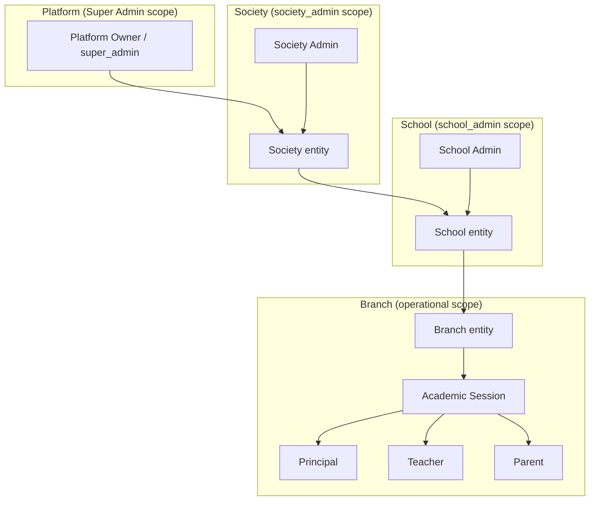
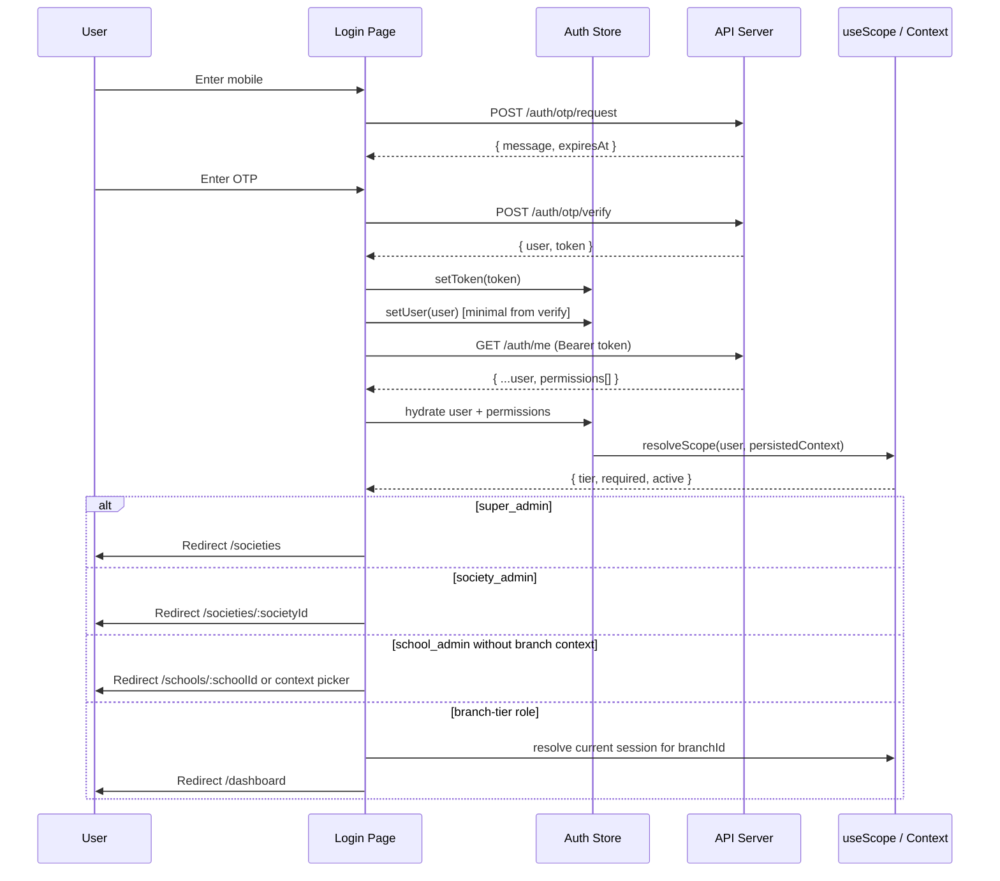
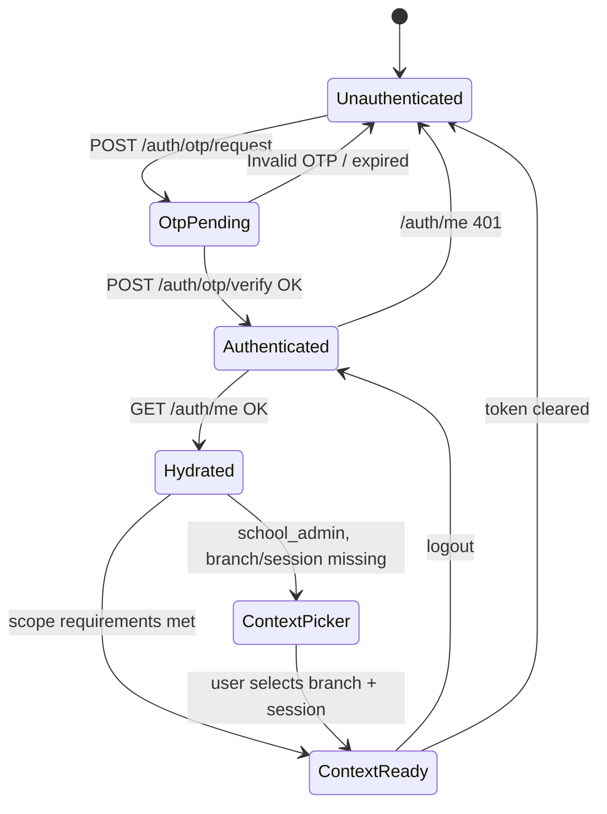

# Phase 1.5 — Auth & Hierarchy Rebuild

**Status:** Architecture report — approval required before implementation  
**Date:** 2026-06-12  
**Constraint:** Reuse existing pages, routes, and API surfaces. Do not build new product modules.

---

## Executive Summary

The backend models a multi-tier org tree with OTP auth. The frontend still uses a **mock role picker** that assigns `schoolId=1`, `branchId=1`, `sessionId=1` to every user. API client legacy shims hardcode the same defaults. The two hierarchies diverge, so Super Admin and Society Admin cannot behave correctly even though OTP login works at the API layer.

Phase 1.5 unifies auth around real OTP + `/auth/me`, introduces role-aware scope, removes hardcoded fallbacks, and aligns frontend routing with the backend hierarchy — without adding new product modules.

---

## Problem Statement

| Layer | Current state |
|-------|---------------|
| **Backend** | Platform → Society → School → Branch → Session hierarchy; OTP auth; nullable scope on `users` |
| **Frontend** | Mock role picker; Zustand persist with hardcoded `1/1/1`; no Bearer token; no `/auth/me` |
| **API client** | `legacy-compat.ts` maps all `schoolId` calls to `DEFAULT_BRANCH_ID=1`, `DEFAULT_SESSION_ID=1` |
| **Guards** | Nav role filter only; no route guards; API routes largely unauthenticated |

---

## Target Hierarchy

### Organizational tree

```
Platform Owner (super_admin)
    └── Society (society_admin)
            └── School (school_admin)
                    └── Branch
                            └── Academic Session
                                    ├── Principal
                                    ├── Teacher
                                    └── Parent
```

**Canonical path:** `Platform → Society → School → Branch → Session → (Principal | Teacher | Parent)`

### Mermaid — org tree



### Role-to-scope matrix

| Role | Scope tier | Required IDs | Optional IDs | Must NOT require |
|------|------------|--------------|--------------|------------------|
| `super_admin` | Platform | — | `societyId`, `schoolId`, `branchId`, `sessionId` (impersonation) | school, branch, session |
| `society_admin` | Society | `societyId` | `schoolId` (drill-down) | branch, session |
| `school_admin` | School | `schoolId` | `branchId`, `sessionId` | session until branch chosen |
| `principal` | Branch | `branchId`, `sessionId` | — | — |
| `teacher` | Branch | `branchId`, `sessionId` | — | — |
| `parent` | Branch | `branchId`, `sessionId` | — | — |

### Existing roles not in target diagram

| Role | Proposed tier | Notes |
|------|---------------|-------|
| `accountant` | Branch | Same rules as `teacher` |
| `coordinator` | Branch | Same rules as `teacher` |
| `student` | Branch | Same rules as `parent` (self-scoped) |

### Two-layer scope model

| Layer | Source | Purpose |
|-------|--------|---------|
| **Identity scope** | From `/auth/me` (`users` row) | What the user is allowed to access |
| **Active context** | Client-selected (persisted) | Which school/branch/session the UI operates on |

```
Identity scope (server)     Active context (client, optional)
─────────────────────────   ─────────────────────────────────
super_admin: all null       optional drill-down only
society_admin: societyId=1  optional schoolId
school_admin: schoolId=1    optional branchId + sessionId
principal: branchId=1       sessionId from current session API
```

Super Admin never *requires* active context to land after login. School Admin may browse school-level pages without branch; branch/session pages require context selection first.

---

## Auth Flow

### End-to-end login (replacing mock picker)



### Session lifecycle



### Token and persistence

| Item | Storage | Key |
|------|---------|-----|
| Bearer token | Zustand persist / localStorage | `school-os-token` |
| User + permissions | Zustand persist | `school-os-auth` |
| Active context | Zustand persist | `school-os-context` |
| OTP transient state | React state only | — |

**Bootstrap (`main.tsx`):**

```
setAuthTokenGetter(() => authStore.getToken())
on app load: if token exists → GET /auth/me → rehydrate or clear on 401
```

### Remove / replace (no new modules)

| Remove | Replace with |
|--------|----------------|
| `login(role)` mock in `auth.ts` | OTP verify + `/auth/me` |
| Role buttons in `login.tsx` | Mobile + OTP inputs (existing `input-otp` UI) |
| `ROLE_NAMES` / `ROLE_EMAILS` maps | Real user from API |
| `DEFAULT_BRANCH_ID = 1` in `legacy-compat.ts` | Role-aware `useScope()` values |
| Render-time `setLocation` in `Layout` | `ProtectedRoute` wrapper or `useEffect` |

---

## Route Map

### Frontend routes — current vs target

| Route | Current access | Target role access | Required scope | API source |
|-------|----------------|-------------------|----------------|------------|
| `/login` | Public | Public | — | — |
| `/societies` | N/A | `super_admin` | None | `GET /societies` |
| `/societies/:id` | N/A | `super_admin`, `society_admin` | `societyId` match | `GET /societies/:id`, `/dashboard` |
| `/schools` | `super_admin` (nav only) | `super_admin`, `society_admin` | None / society filter | `GET /schools` or `/societies/:id/schools` |
| `/schools/:id` | N/A | `super_admin`, `society_admin`, `school_admin` | `schoolId` | `GET /schools/:id` |
| Context picker (modal/bar) | N/A | `school_admin` when branch unset | `schoolId` | `GET /schools/:id/branches`, `/sessions/current` |
| `/dashboard` | All logged-in (mock) | Branch-tier + `school_admin` with context | `branchId` (+ `sessionId`) | `GET /branches/:branchId/dashboard` |
| `/students/*` | school roles | `school_admin`, `principal`, `teacher` | branch + session | branch/session student routes |
| `/staff` | school roles | `school_admin`, `principal` | branch | `/branches/:branchId/users` |
| `/classes`, `/subjects`, `/examinations` | school roles | branch-tier ops roles | branch + session | existing routes |
| `/attendance`, `/fees`, `/fee-structure` | school roles | branch-tier ops roles | branch + session | existing |
| `/staff-attendance`, `/announcements` | school roles | branch-tier ops roles | branch | existing |
| `/school-settings`, `/udise` | mixed | elevated + school roles | `schoolId` | school-scoped routes |
| `/analytics`, `/activity` | school roles | branch-tier ops roles | branch + session | fix analytics path |
| `/` | → `/login` | → role-based home | — | — |

### Default post-login redirect

| Role | Landing route |
|------|---------------|
| `super_admin` | `/societies` |
| `society_admin` | `/societies/:societyId` |
| `school_admin` | `/schools/:schoolId` (or `/dashboard` if branch context set) |
| `principal`, `teacher`, `accountant`, `coordinator`, `parent`, `student` | `/dashboard` |

### Route guard matrix

```
Public:     /login
Auth only:  /societies, /schools
Auth+Role:  all operational routes
Auth+Scope: branch/session routes require useScope().isReady
```

Proposed guard: `ProtectedRoute` in `src/lib/route-guard.tsx` (single file, not a module).

### API route tiers (add auth middleware only)

| Tier | Example endpoints | Who may call |
|------|-------------------|--------------|
| Public | `/healthz`, `/auth/otp/*` | Anyone |
| Auth | `/auth/me`, `/auth/logout` | Bearer required |
| Platform | `GET /societies`, `GET /schools` | `super_admin` |
| Society | `GET /societies/:id/*` | `super_admin`, matching `society_admin` |
| School | `GET/PATCH /schools/:id/*`, UDISE | super, society, matching school_admin+ |
| Branch | `/branches/:branchId/*` | roles with access to that branch |
| Session | `/branches/:bid/sessions/:sid/*` | branch-tier roles + school_admin in context |

Shared middleware in `artifacts/api-server/src/lib/` (e.g. `require-auth.ts`, `authorize-scope.ts`).

---

## Required DB Changes

**Minimal — schema largely ready. No new tables for Phase 1.5.**

### No change required

| Item | Status |
|------|--------|
| `platforms`, `societies`, `schools`, `branches`, `academic_sessions` | Exist |
| `users.societyId / schoolId / branchId` nullable FKs | Correct |
| `roles.scope` enum (`platform`, `society`, `school`, `branch`) | Correct |
| `super_admin` seeded with null scope | Correct |
| `society_admin` seeded with `societyId` only | Correct |

### Seed / data fixes (not schema)

| Change | Reason |
|--------|--------|
| `school_admin` users: make `branchId` nullable in seed | Aligns with "branch optional" rule |
| Document `users.roleId` as canonical for Phase 1.5 | `user_role_assignments` unused at runtime |

### Optional (defer)

| Change | When |
|--------|------|
| `users.metadata.activeBranchId / activeSessionId` | Server-side context persistence later |
| Populate `user_role_assignments` | Phase 2+ multi-role users |
| Platform dashboard materialized view | Only if aggregate KPIs are slow |

**Recommendation:** Keep active branch/session in **client persist only** for Phase 1.5.

### OpenAPI / generated client

| Change |
|--------|
| Add `society_admin` to `UserRole` enum |
| Add optional `sessionId` to `User` if returned from `/auth/me` for branch users |
| Add `AuthContext` schema: `{ societyId?, schoolId?, branchId?, sessionId? }` |

---

## Required API Changes

All changes are middleware + response shaping in existing routes. No new route files.

### Auth responses

**`buildAuthUser()` / `/auth/me`:**

| Field | Change |
|-------|--------|
| `permissions` | Include on verify (optional) or keep `/auth/me` only |
| `sessionId` | Resolve via `resolveCurrentSession(branchId)` when `branchId` present |
| `roleScope` | Derived: `platform \| society \| school \| branch` from `roles.scope` |

**Example `/auth/me` for Super Admin:**

```json
{
  "id": 1,
  "role": "super_admin",
  "roleScope": "platform",
  "societyId": null,
  "schoolId": null,
  "branchId": null,
  "sessionId": null,
  "permissions": ["platform.full_access"]
}
```

### Auth middleware

```
requireAuth          → all routes except /healthz, /auth/otp/*
authorizePlatform    → GET /societies, GET /schools (list)
authorizeSociety     → /societies/:societyId/*
authorizeSchool      → /schools/:schoolId/*
authorizeBranch      → /branches/:branchId/*
authorizeSession     → /branches/:bid/sessions/:sid/*
```

Logic:

1. Load user from Bearer token
2. Compare URL params to identity scope (`super_admin` bypass)
3. Return `403` if out of scope; `401` if no token

### Platform dashboard gap

Existing:

- `GET /societies/:societyId/dashboard`
- `GET /branches/:branchId/dashboard`

Missing:

- `GET /platform/dashboard`

**Proposal:** Super Admin uses `GET /societies` + `GET /schools` on existing `/schools` page — no new endpoint unless aggregate KPIs are needed.

### Legacy-compat retirement (API client)

| Current shim | Replacement |
|--------------|-------------|
| `useGetSchoolDashboard(schoolId)` → branch 1 | `useGetBranchDashboard(branchId)` via `useScope()` |
| `useListStudents(schoolId)` → branch 1 | `useListStudents(branchId, sessionId)` |
| `DEFAULT_BRANCH_ID = 1` | Deleted |

### Broken path fix

| Broken | Correct |
|--------|---------|
| `GET /schools/:id/analytics/classes` | `GET /branches/:bid/sessions/:sid/analytics/classes` |

---

## Required UI Changes

All within existing `artifacts/school-os/` pages.

### `auth.ts` — rewrite store

```typescript
interface AuthState {
  token: string | null;
  user: AuthUser | null;
  permissions: string[];
  context: ActiveContext | null;
  isHydrated: boolean;
  requestOtp(mobile): Promise<void>;
  verifyOtp(mobile, otp): Promise<void>;
  hydrate(): Promise<void>;
  setContext(partial): void;
  logout(): void;
}
```

Remove: `login(role: UserRole)`, hardcoded scope, mock name/email maps.

### `login.tsx` — OTP UI

1. Mobile input → `useRequestOtp`
2. OTP input → `useVerifyOtp`
3. On success → `hydrate()` → role-based redirect

Dev OTP: `123456` (seeded users).

### `use-scope.ts` — role-aware

```typescript
function useScope() {
  return {
    tier: "platform" | "society" | "school" | "branch",
    societyId: number | null,
    schoolId: number | null,
    branchId: number | null,
    sessionId: number | null,
    isReady: boolean,
    requiresContext: boolean,
    setContext: (ctx) => void,
  };
}
```

| Role | `isReady` when |
|------|----------------|
| `super_admin` | Always |
| `society_admin` | `societyId` from identity |
| `school_admin` | `schoolId` from identity; branch/session only for branch routes |
| `principal`, `teacher`, `parent`, etc. | `branchId` + `sessionId` resolved |

**Remove all `?? 1` fallbacks.**

### `main.tsx` — wire token

```typescript
setAuthTokenGetter(() => useAuthStore.getState().token);
// on mount: hydrate if token present
```

### `App.tsx` — guards

Wrap routes with `ProtectedRoute`: `requireAuth`, `allowedRoles?`, `requireScopeTier?`.

Move redirect out of `Layout` render path.

### `layout.tsx` — nav by tier

| Nav item | Roles | Min tier |
|----------|-------|----------|
| Societies | `super_admin` | platform |
| Schools | `super_admin`, `society_admin` | platform / society |
| Dashboard | branch-tier + `school_admin` (with context) | branch |
| Students, Staff, etc. | ops roles | branch + session |

Add `society_admin` to nav. Remove Super Admin from branch-only ops unless impersonating (future).

### Page migration checklist

| Page | Change |
|------|--------|
| `dashboard.tsx` | `useGetBranchDashboard(scope.branchId)`; platform/society variants for elevated roles |
| `schools.tsx` | Filter by `societyId` for society_admin |
| `students.tsx`, `staff.tsx`, etc. | Pass `scope.branchId`, `scope.sessionId` — delete `\|\| 1` |
| `analytics.tsx` | Fix API path to branch/session endpoint |
| `classes.tsx`, `subjects.tsx`, etc. | Remove fallback once hook is fixed |

### Context picker (minimal UX)

Inline component `src/components/scope-context-bar.tsx`:

- Shown when `school_admin` and branch/session unset
- APIs: `GET /schools/:id/branches`, `GET /branches/:id/sessions/current`
- Writes to `authStore.context`

---

## Implementation Phases

| Step | Scope | Risk |
|------|-------|------|
| **1.5a** | Auth store + OTP login + token + `/auth/me` + bootstrap | Low |
| **1.5b** | Role-aware `useScope`, remove `?? 1`, context picker | Medium |
| **1.5c** | Route guards + nav tier map + post-login redirects | Medium |
| **1.5d** | API auth middleware | Medium |
| **1.5e** | Retire `legacy-compat.ts` shims page-by-page | Medium |
| **1.5f** | OpenAPI: add `society_admin`, regenerate client | Low |

Suggested order: **1.5a → 1.5b → 1.5c → 1.5e → 1.5d**

---

## Out of Scope (Phase 1.5)

- New product modules (billing, CRM, parent portal, etc.)
- `user_role_assignments` enforcement
- Multi-role per user
- Server-side session/context persistence
- Impersonation UI for Super Admin
- Parent-specific portal routes

---

## Success Criteria

- [ ] No mock role picker remains
- [ ] Login uses OTP against seeded users (e.g. Super Admin `8707488250`)
- [ ] Bearer token sent on all API calls
- [ ] `/auth/me` hydrates user on refresh
- [ ] Super Admin lands without branch/session; sees societies/schools
- [ ] Society Admin operates at society tier without branch/session
- [ ] School Admin works at school tier; branch/session required only for ops pages
- [ ] Principal/Teacher require branch + session; dashboard loads real branch data
- [ ] No `branchId=1` or `sessionId=1` fallbacks in frontend
- [ ] Direct URL to ops routes blocked when scope not ready

---

## Approval Checklist

Confirm before implementation:

1. **Super Admin home:** `/societies` (list) vs `/platform` alias?
2. **School Admin default landing:** `/schools/:schoolId` vs `/dashboard` when branch in identity?
3. **Parent / accountant / coordinator / student:** treat as branch-tier (same as teacher)?
4. **API auth middleware:** include in Phase 1.5 or defer to 1.5d after UI?
5. **Context persistence:** client-only (recommended) vs `users.metadata`?

---

## Related Files

| Area | Path |
|------|------|
| Frontend auth (mock) | `artifacts/school-os/src/lib/auth.ts` |
| Frontend scope | `artifacts/school-os/src/lib/use-scope.ts` |
| Login page | `artifacts/school-os/src/pages/login.tsx` |
| Layout / nav | `artifacts/school-os/src/components/layout.tsx` |
| Routes | `artifacts/school-os/src/App.tsx` |
| API auth | `artifacts/api-server/src/routes/auth.ts` |
| Auth helpers | `artifacts/api-server/src/lib/auth-helpers.ts` |
| Scope resolution | `artifacts/api-server/src/lib/scope.ts` |
| Legacy shims | `lib/api-client-react/src/legacy-compat.ts` |
| OpenAPI spec | `lib/api-spec/openapi.yaml` |
| Seed data | `lib/db/src/seed-phase0-foundation.ts` |
| Phase 0 architecture | `PHASE0_ARCHITECTURE.md` |

---

**Awaiting approval to proceed with implementation.**
