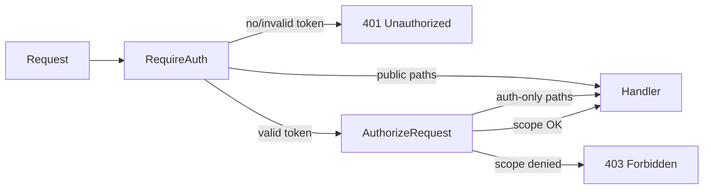

# Phase 1.5 Security Audit Report

**Date:** 2026-06-12  
**Scope:** API security layer (authentication + authorization middleware)  
**Status:** Implemented and verified

---

## Executive Summary

All API routes under `/api` are now protected by bearer-token authentication and role-based scope authorization. Unauthenticated requests receive **401 Unauthorized**. Authenticated requests outside the caller's scope receive **403 Forbidden**. OpenAPI documentation was updated to reflect credential-based auth; OTP paths and schemas were removed.

---

## Architecture

### Middleware stack

Applied globally in `artifacts/api-server/src/routes/index.ts`:

1. **`requireAuth`** (`lib/require-auth.ts`) — Validates `Authorization: Bearer token-{userId}`, loads session via `loadAuthSession`, rejects inactive/blocked users.
2. **`authorizeRequest`** (`lib/authorize-request.ts`) — Enforces scope rules via `validateRequestAccess` (`lib/authorize-access.ts`).

### Public routes (no bearer token)

| Path | Method |
|------|--------|
| `/healthz` | GET |
| `/auth/captcha` | GET |
| `/auth/login` | POST |
| `/auth/password/forgot` | POST |

### Auth-only routes (token required, no resource scope)

| Path | Method |
|------|--------|
| `/auth/me` | GET |
| `/auth/logout` | POST |

---

## Authorization Rules

| Role | Access |
|------|--------|
| **Super Admin** | Full platform access |
| **Society Admin** | Own society only; list `/societies` filtered to own record; `POST /schools` limited to own `societyId` |
| **School Admin** | Own school only; any branch/session under that school |
| **Principal / Teacher / Accountant / Coordinator** | Own branch; session-scoped routes require matching `sessionId` |
| **Parent** | Routes containing own `studentId` only; list endpoints blocked |
| **Student** | Same as parent (self `studentId` only) |

Resource IDs are extracted from URL path segments (middleware runs before route param binding).

Hierarchy validation uses DB lookups for nested resources (school → society, branch → school, session → branch).

---

## Verification Results

Tested against rebuilt API on port 5000:

| Scenario | Expected | Actual |
|----------|----------|--------|
| `GET /branches/1/sessions/1/students` without token | 401 | **401** |
| Invalid token `token-99999` on `/auth/me` | 401 | **401** |
| Super admin `GET /platform/dashboard` | 200 | **200** |
| Principal `GET /platform/dashboard` | 403 | **403** |
| Principal own branch dashboard | 200 | **200** |
| Principal branch 999 dashboard | 403 | **403** |
| Society admin `GET /societies` | 200 | **200** |
| Society admin `GET /schools` (unscoped list) | 403 | **403** |
| Parent list students | 403 | **403** |
| Parent wrong studentId | 403 | **403** |
| Teacher wrong sessionId | 403 | **403** |

---

## OpenAPI Updates

File: `lib/api-spec/openapi.yaml`

- Removed `/auth/otp/request`, `/auth/otp/verify`, and OTP schemas
- Added `/auth/captcha`, `/auth/login`, `/auth/password/forgot`
- Added `bearerAuth` security scheme; global security default with public-route overrides
- Added `LoginBody`, `LoginResponse`, `CaptchaResponse`, `ForbiddenResponse`
- Extended `UserRole` with `society_admin`, `coordinator`; added `RoleScopeTier`
- Added `/platform/dashboard` path
- Regenerated client via `pnpm run codegen` in `lib/api-spec` (orval succeeded; workspace typecheck has pre-existing unrelated errors)

---

## Files Changed

| File | Change |
|------|--------|
| `artifacts/api-server/src/lib/require-auth.ts` | Bearer auth middleware |
| `artifacts/api-server/src/lib/authorize-request.ts` | Authorization middleware |
| `artifacts/api-server/src/lib/authorize-access.ts` | Scope validation + path ID extraction |
| `artifacts/api-server/src/lib/auth-context.ts` | Typed `req.auth` context |
| `artifacts/api-server/src/routes/index.ts` | Middleware wiring |
| `artifacts/api-server/src/routes/organizations.ts` | Society list filter; POST school society check |
| `artifacts/api-server/src/routes/auth.ts` | `/auth/me` uses `req.auth`; removed OTP message |
| `artifacts/api-server/src/lib/auth-token.ts` | Removed unused `devOtpHash` |
| `lib/api-spec/openapi.yaml` | Auth docs + security scheme |

---

## Residual Notes

1. **Token format** — Dev tokens are `token-{userId}`. Production should use signed JWTs with expiry and rotation.
2. **List endpoints** — Unscoped `GET /schools` is super-admin only at middleware level. Society/school admins must use scoped nested routes.
3. **Handler-level checks** — Middleware enforces scope; handlers should still validate resource existence (404 vs 403).
4. **DB OTP artifacts** — `otp_login_events` table and seed bypass codes remain in schema for future recovery flows but are not exposed via API or OpenAPI.
5. **Restart required** — Deploy/restart API after build for middleware to take effect.

---

## Conclusion

Direct API calls cannot bypass role scope. Authentication and authorization middleware cover all mounted routers. Appropriate **401** and **403** responses are returned. OpenAPI no longer documents OTP login.
