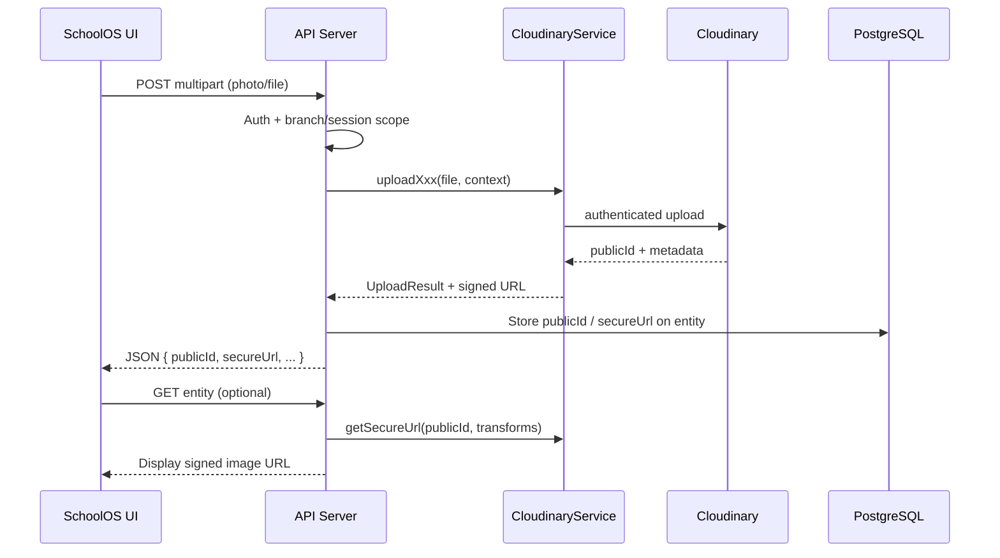

# Cloudinary Setup — SchoolOS

SchoolOS stores media (student photos, staff photos, school/branch logos, announcement attachments) in [Cloudinary](https://cloudinary.com/). Credentials are read from environment variables only — never hardcoded in source.

---

## Prerequisites

1. Create a [Cloudinary account](https://cloudinary.com/users/register/free).
2. Open the [Cloudinary Console](https://console.cloudinary.com/) → **Dashboard**.
3. Copy **Cloud name**, **API Key**, and **API Secret**.

---

## Environment variables

Add these to the project root `.env` (same file used by the API server and Drizzle):

```env
CLOUDINARY_CLOUD_NAME=your_cloud_name
CLOUDINARY_API_KEY=your_api_key
CLOUDINARY_API_SECRET=your_api_secret
```

| Variable | Required | Description |
|----------|----------|-------------|
| `CLOUDINARY_CLOUD_NAME` | Yes (for uploads) | Cloudinary cloud identifier |
| `CLOUDINARY_API_KEY` | Yes (for uploads) | Server-side API key |
| `CLOUDINARY_API_SECRET` | Yes (for uploads) | Server-side secret — **never expose to the browser** |

The API server loads `.env` via `node --env-file=../../.env` when started with `pnpm run start:api`.

Use `isCloudinaryConfigured()` from `@workspace/cloudinary` to check whether all three variables are set before calling upload APIs.

---

## Package layout

```
lib/integrations/cloudinary/
├── package.json              # @workspace/cloudinary
└── src/
    ├── config.ts             # Env-based credential loading
    ├── folders.ts            # Tenant-scoped folder paths
    ├── secure-url.ts         # Signed delivery URLs
    ├── service.ts            # CloudinaryService
    ├── types.ts
    └── index.ts

artifacts/api-server/src/lib/
└── cloudinary.ts             # API server re-export + assertMediaUploadReady()
```

Install workspace dependency (already wired in `artifacts/api-server/package.json`):

```bash
pnpm install
```

---

## Using the service

```typescript
import { cloudinaryService, isCloudinaryConfigured } from "@workspace/cloudinary";

if (!isCloudinaryConfigured()) {
  throw new Error("Cloudinary env vars are missing");
}

const result = await cloudinaryService.uploadStudentPhoto(fileBuffer, {
  societyId: 1,
  schoolId: 2,
  branchId: 3,
  sessionId: 4,
  studentId: 42,
});

// Persist result.publicId (or result.secureUrl) on the student record
await db.update(studentsTable)
  .set({ photoUrl: result.secureUrl })
  .where(eq(studentsTable.id, 42));

// Later: regenerate a signed URL (e.g. after token expiry policy changes)
const url = cloudinaryService.getSecureUrl(result.publicId, {
  width: 200,
  height: 200,
  crop: "fill",
  quality: "auto",
  format: "auto",
});
```

### Supported upload methods

| Method | Purpose | Resource type |
|--------|---------|---------------|
| `uploadStudentPhoto(file, context)` | Student profile photo | `image` |
| `uploadStaffPhoto(file, context)` | Branch staff / user photo | `image` |
| `uploadSchoolLogo(file, context)` | Society school logo | `image` |
| `uploadBranchLogo(file, context)` | Branch logo | `image` |
| `uploadAnnouncementAttachment(file, context, filename?)` | Announcement file (PDF, image, etc.) | `auto` |

`file` may be a filesystem path (`string`) or a `Buffer` (e.g. from multipart middleware).

### Secure delivery

- Uploads use Cloudinary **`authenticated`** type so assets are not publicly enumerable.
- `getSecureUrl()` returns **signed HTTPS URLs** (`sign_url: true`, `secure: true`).
- Optional transforms: width, height, crop, quality, format.

### Deleting assets

```typescript
await cloudinaryService.deleteAsset(publicId, "image");
// For announcement PDFs: resourceType "raw"
```

---

## Folder structure (Cloudinary)

All assets live under the `schoolos/` prefix, scoped by tenant hierarchy:

```
schoolos/
├── students/{societyId}/{schoolId}/{branchId}/{sessionId}/{studentId}/photo
├── staff/{societyId}/{schoolId}/{branchId}/{userId}/photo
├── schools/logos/{societyId}/{schoolId}/logo
├── branches/logos/{societyId}/{schoolId}/{branchId}/logo
└── announcements/attachments/{societyId}/{schoolId}/{branchId}/{announcementId}/{filename}
```

This keeps assets isolated per organization and makes bulk cleanup or migration predictable.

---

## Image upload architecture (future)

Planned end-to-end flow for each entity type:



### Entity mapping

| Entity | DB field (current / planned) | Upload method | Notes |
|--------|------------------------------|---------------|-------|
| **Students** | `students.photo_url` (exists) | `uploadStudentPhoto` | Scope: branch + session + student id |
| **Staff** | `users.metadata.avatarUrl` (planned) or dedicated column | `uploadStaffPhoto` | Staff are branch-scoped users |
| **Schools** | `schools.logo_url` (planned) | `uploadSchoolLogo` | Society-level school branding |
| **Branches** | `branches.logo_url` (planned) | `uploadBranchLogo` | Branch-specific branding |
| **Announcements** | attachment table or JSON array (planned) | `uploadAnnouncementAttachment` | Supports images, PDFs via `resource_type: auto` |

### Recommended API routes (not yet implemented)

| Route | Service call |
|-------|----------------|
| `POST /api/branches/:branchId/sessions/:sessionId/students/:studentId/photo` | `uploadStudentPhoto` |
| `POST /api/branches/:branchId/users/:userId/photo` | `uploadStaffPhoto` |
| `POST /api/schools/:schoolId/logo` | `uploadSchoolLogo` |
| `POST /api/branches/:branchId/logo` | `uploadBranchLogo` |
| `POST /api/branches/:branchId/announcements/:id/attachments` | `uploadAnnouncementAttachment` |

Implementation checklist:

1. Add multipart middleware (e.g. `multer` memory storage) on the API server.
2. Reuse existing scope helpers (`resolveBranchScope`, `resolveSessionScope`).
3. Persist `publicId` in the database; regenerate signed URLs on read when needed.
4. Extend OpenAPI + run `pnpm --filter @workspace/api-spec run codegen`.
5. Add UI file pickers on student/staff/school forms.

### Security rules

- **Never** send `CLOUDINARY_API_SECRET` to the client.
- Prefer server-side uploads through the API (not unsigned browser uploads).
- Validate MIME type and max file size before calling Cloudinary.
- Use authenticated assets + signed URLs for student/staff photos (PII).

---

## Cloudinary console settings

1. **Settings → Security**: restrict allowed fetch domains if using remote fetch (not required for direct uploads).
2. **Settings → Upload**: optional upload presets if you later add signed direct-to-Cloudinary uploads from the browser.
3. Enable **Strict Transformations** in production if you want to lock down URL transforms.

---

## Troubleshooting

| Symptom | Fix |
|---------|-----|
| `Cloudinary is not configured` | Set all three env vars and restart the API server |
| 401 from Cloudinary | Verify API key/secret match the cloud name |
| Image loads in console but not in app | Ensure URL uses `type: authenticated` and `sign_url: true` |
| Upload works locally but not on Render | Add the three variables in the Render service **Environment** tab |

---

## Related files

- Service: `lib/integrations/cloudinary/src/service.ts`
- API helper: `artifacts/api-server/src/lib/cloudinary.ts`
- Student schema: `lib/db/src/schema/students.ts` (`photoUrl`)
- Local env guide: `LOCAL_SETUP.md`
